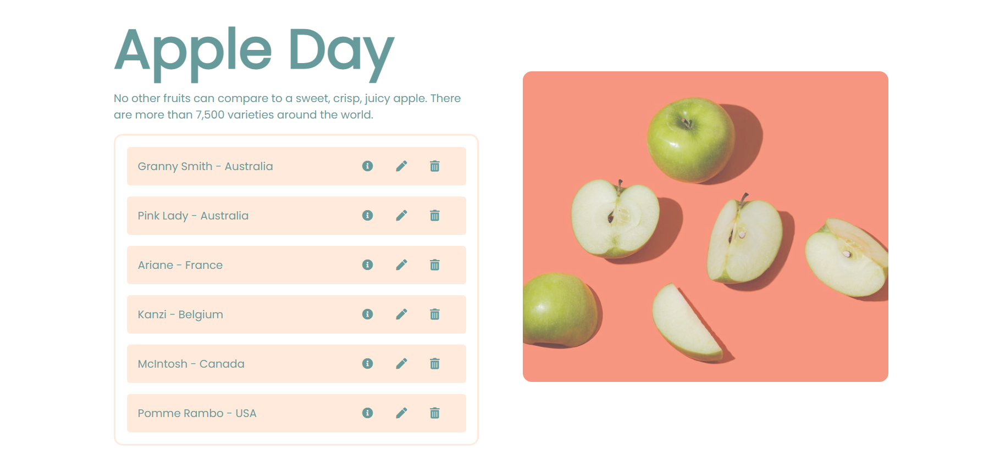

# Create, read, update and delete

### *My very first Php single page application implementing MySQL with CRUD functions.* 
 
:green_apple: :apple: Show the collections of apples around the world! :apple: :green_apple:  
  

## Functions:
Step 1: read
 - Getting information in database and show the content in the page

Step 2: create
 - Allow users to add information to tables in database

Step 3: update
 - Updating the record in the database.

Step 4: delete
- removing record from database.
 
---
### Tools:
- Php
- SQL
- Xampp
- VS code

